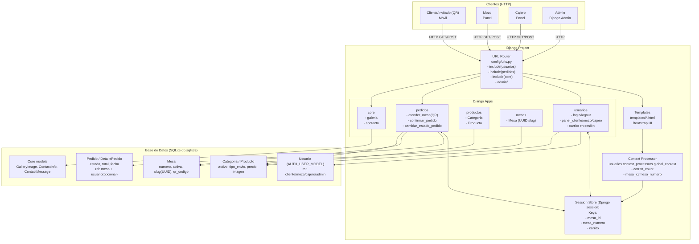

```mermaid
flowchart TB
  %% Actores/Clientes
  subgraph Clients["Clientes (HTTP)"]
    C1["Cliente/Invitado (QR)\nMóvil"]
    C2["Mozo\nPanel"]
    C3["Cajero\nPanel"]
    C4["Admin\nDjango Admin"]
  end

  %% Capa Web
  subgraph Django["Django Project"]
    U["URL Router\nconfig/urls.py\n- include(usuarios)\n- include(pedidos)\n- include(core)\n- admin/"]
    T["Templates\ntemplates/*.html\nBootstrap UI"]
    CP["Context Processor\nusuarios.context_processors.global_context\n- carrito_count\n- mesa_id/mesa_numero"]

    subgraph Apps["Django Apps"]
      A1["usuarios\n- login/logout\n- panel_cliente/mozo/cajero\n- carrito en sesión"]
      A2["pedidos\n- atender_mesa(QR)\n- confirmar_pedido\n- cambiar_estado_pedido"]
      A3["productos\n- Categoria\n- Producto"]
      A4["mesas\n- Mesa (UUID slug)"]
      A5["core\n- galeria\n- contacto"]
    end

    S["Session Store (Django session)\nKeys:\n- mesa_id\n- mesa_numero\n- carrito"]
  end

  %% Persistencia
  subgraph DB["Base de Datos (SQLite db.sqlite3)"]
    M1["Usuario (AUTH_USER_MODEL)\nrol: cliente/mozo/cajero/admin"]
    M2["Mesa\nnumero, activa, slug(UUID), qr_codigo"]
    M3["Categoria / Producto\nactivo, tipo_envio, precio, imagen"]
    M4["Pedido / DetallePedido\nestado, total, fecha\nrel: mesa + usuario(opcional)"]
    M5["Core models\nGalleryImage, ContactInfo, ContactMessage"]
  end

  %% Relaciones
  C1 -->|"HTTP GET/POST"| U
  C2 -->|"HTTP GET/POST"| U
  C3 -->|"HTTP GET/POST"| U
  C4 -->|"HTTP"| U

  U --> T
  T --> CP
  CP --> S

  U --> A1
  U --> A2
  U --> A5

  A1 <--> S
  A2 <--> S

  A1 --> M1
  A2 --> M4
  A2 --> M2
  A2 --> M3
  A1 --> M3
  A5 --> M5
  A4 --> M2
  A3 --> M3
```
